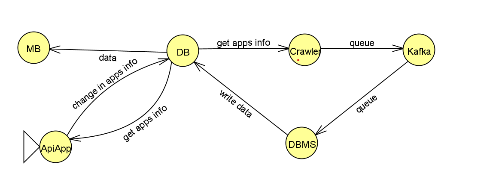

# Google-Play Store data crawler app

This Project can collect data about apps on Google-Play Store and their reviews and you can use MetaBase to analyse the data stored in the database.

## Components


## Installation

You just need to have docker and python installed on your system , other things will be installed automatically


## Usage
go to project directory and run:
```python
docker compose up --build
```
you can access MetaBase by default on :
```python
localhost:3000
```
also you can use this command to access the database itself:
```python
docker exec -it postgres psql -U <databaseUsername>
```
To use Django commands execute this command(Like runnig unit tests):
```python
docker exec -it django python manage.py <FunctionName>
```
You can use the below command to access kafka container shell(By default KafkaContainerName is 'kafka'):
```python
docker exec --workdir /opt/kafka/bin/ -it <KafkaContainerName> sh
```
For more inforamtion about CRUD API you can visit one of the following addresses:
```python
localhost:8000/swagger/
localhost:8000/schema/
localhost:8000/redoc/
```
and 
## Contributing

Pull requests are welcome. For major changes, please open an issue first
to discuss what you would like to change.

Please make sure to update tests as appropriate.

## License

[Are you seriously looking for a license on this project?](https://choosealicense.com/licenses/mit/)
